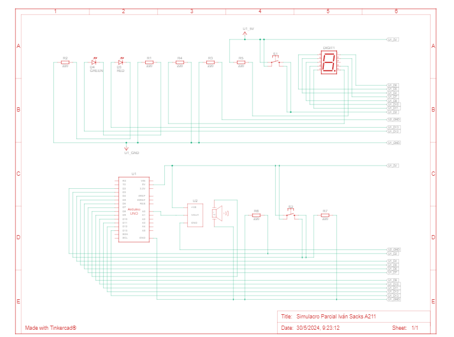
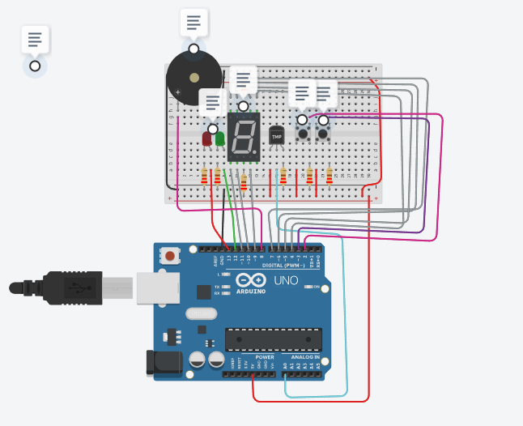

# Documentanción:
## Información Alumno:
Iván Sacks TT SPD A211:pray:

## Diagrama De Conexiones

## :star:Proyecto: Sistema De Incendios:star:

## Descripción
El proyecto es un sistema de incendios que avisa a través de sensores lumínicos y sonoros que ha ocurrido uno.

## Función principal:raised_hands:
Esta funcion se encarga de encender y apagar el sistema de incendios

botonPrendido y  botonApagado #Son variables asignadas a los botones.

(Si el botónPrendido esta en true, se prende el sistema . Yi el botónApagado esta en true, se apaga el sistema) 

~~~ C++ :collision:
void prenderSistema(int botonPrendido, int botonApagado)
  {
    if (botonPrendido)
  {
    sistemaIncendios = HIGH;
  }
  else if (botonApagado)
  {         
    sistemaIncendios = LOW;   
  }
  }
~~~

## :muscle: Link al proyecto
- [proyecto](https://www.tinkercad.com/things/kaS3G6QeOcw-simulacro-parcial-ivan-sacks-a211/editel?sharecode=Df2IqMLfKf2Ypm6Jcaq48aBOQSW4cYphO8chJzJHWeQ)

